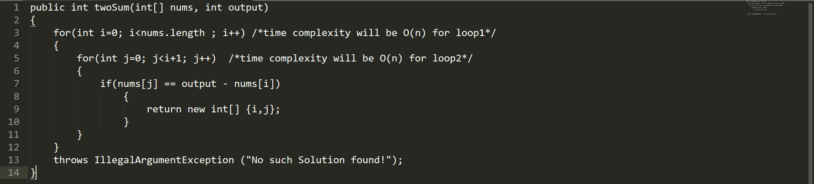
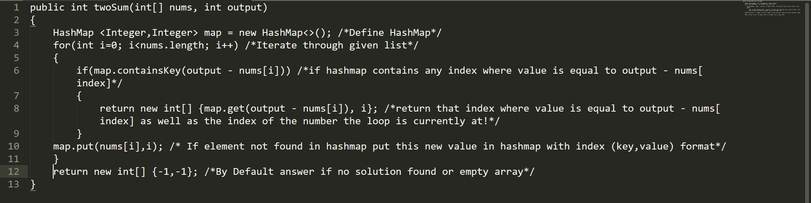

Blog 1: Date: 7 Feb 2019

Problem 1 : Two Sum , Asked in Companies Like(FB, MSFT, Amazon, Bloomberg, Uber, Linkedin, Yelp)
Given an array of integers, return indices of the two numbers such that they add up to a specific target.
You may assume that each input would have exactly one solution, and you may not use the same element twice.

Example: Given nums = [2, 7, 11, 15], target = 9, Because nums[0] + nums[1] = 2 + 7 = 9, return [0,1].

First Approach that comes to our mind is looping through each element and figuring out the sum. Well, this approach is good but yields to an O(n^2) time complexity which is not good compared to an optimal solution. Lets write some code for this brute force solution and then will make it more optimal.

Total Time Complexity will be O(n^2), Space Complexity will be O(n).

Second Approach is about lowering down the time complexity or we can say access time to search all values and iterate through them in an given array. Whenever, we want to access a variable or elements of array in O(1) time, HashMap is said to be the best alternative. In our example, as HashMap takes O(1) time complexity to iterate through all the elements and find the output (solution) it will take O(n) time complexity for our N number of elements given in an Array.

HashMap contains many methods which can be used to your advantage in Java. Here, will discuss the containsKey, Put and Get methods.
Let^s write some code now!

Total Time Complexity will be O(n), Space Complexity will be O(n).

That^s it, we solved the TwoSum Problem.
